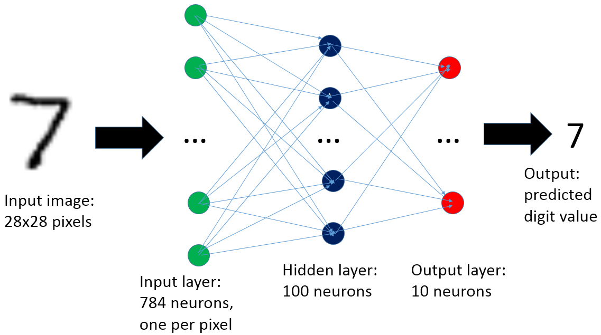

# inverse-neural-network

Every one-to-one function has an inverse. I asked myself what the inverse of a simple neural network would be. Does it even has an inverse?

You can think about a neural network as a concatenation of matrix multiplications, vector addition and non-linearities. So to create the inverse of the network, you would need the inverse of each of those operations.

## The inverse
- Vector addition: This one is easy. The inverse is simply the vector subtraction.
- Matrix multiplication (dot product): Is easy if the matrix is a square matrix. Most of the matrices in a network are not though. So to calculate the inverse of a non square matrix we can use the (Moore-Penrose)-pseudeo-inverse. This is not the exact inverse though and only a "best fit". This means if we have at least one non square matrix in the network the inverse-network will not be exact (but hopefully good enough).
- Non-linearities: This is a problem too. Most activation functions have no inverse on the same function image. Let's take the sigmoid function for example. For this function following condition does not hold:

	Where S(x) is the sigmoid function and S_inv(x) is the inverse of the sigmoid function.
	**S_inv(S(x)) ≠ S(S_inv(x))** --> This is the case because the domain of the inverse is only the positive real numbers.

	Finding an activation function where this holds was actually pretty tricky. The leaky RELU has this property, so I used it for my network.

## Neural Network
In the `neural_network.py` you can find a very simple neural network trained on MNIST. After it archived 80% accuracy I save it as a .h5 file to use it's weights in the inverse-neural-network.

## Inverse-Neural_Network
In `inverse_neural_network.py` you can find the inverse neural network. That takes an 10-dim input and returns a 784 dim output.

It returns the actual 28*28 pixel image that created the 10-dim output. You can use it for example to look at which input to the network would cause it to return the following vector `[0,0,0,0,0,1,0,0,0,0]`. It is the same network but just the other way around.

## Does it work
The implementation works. You can test it out yourself. To test it run the following inference:
	Inverse_Neural_Network( Neural_Network( x ) ) = x

**Remember: The inverse neural network is not exact, because we used the pseudo-inverse. The above equation will contain some small error.**
